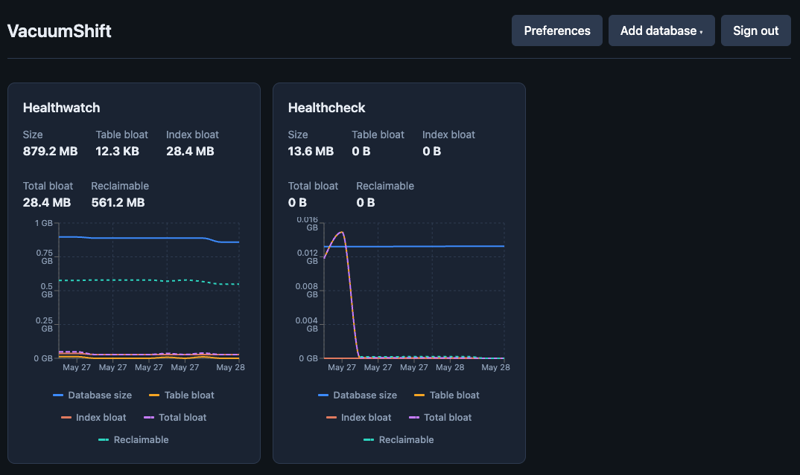
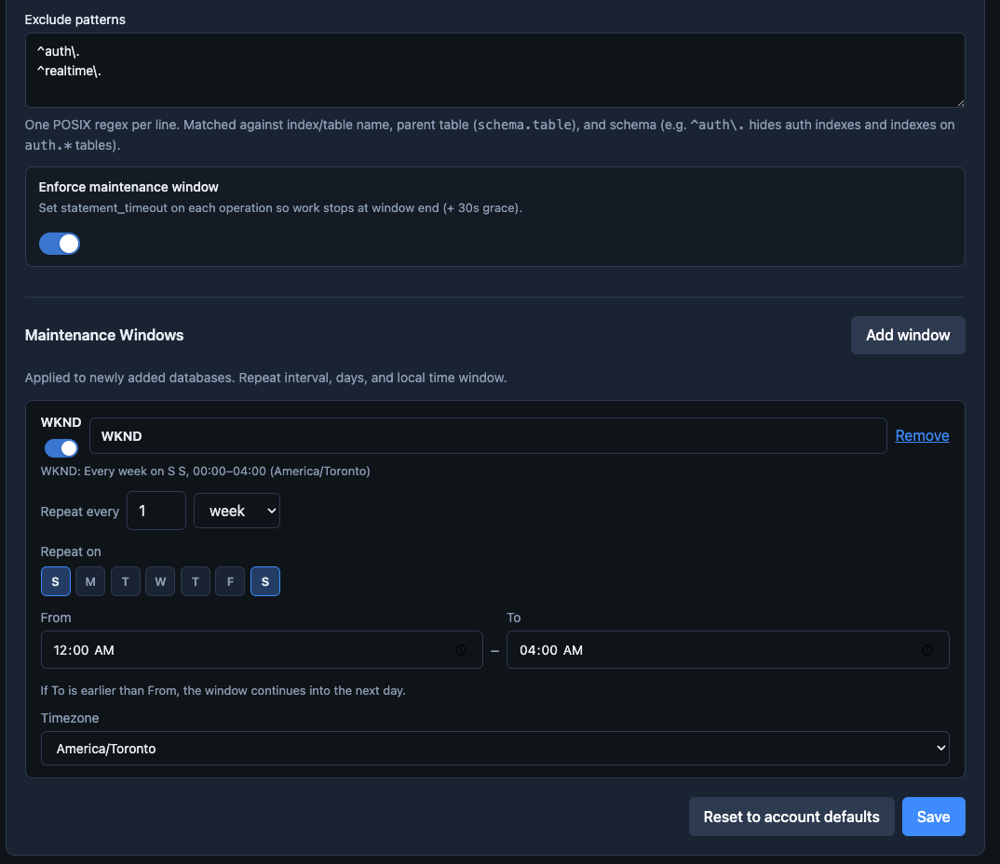
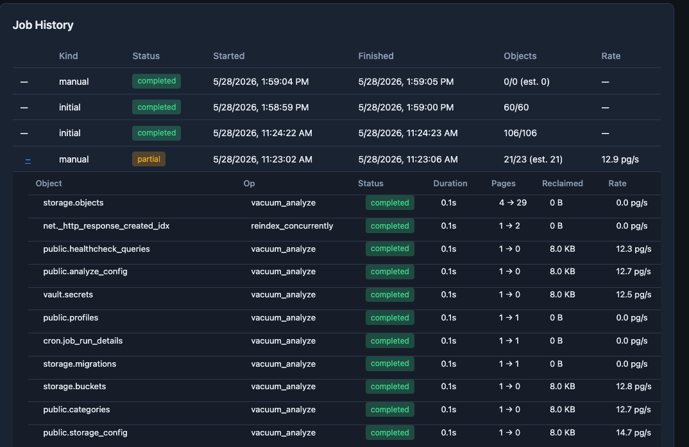

# VacuumShift

Monitor Postgres database bloat, run scheduled or on-demand **VACUUM** / **REINDEX**, and track results over time.   
Built for [Supabase](https://supabase.com) projects, but any Postgres connection string works.

### Dashboard


### Scheduling


### Job Detail


## What it does

- **Supabase import** — list projects with a personal access token, provision a read-only `vacuumshift` role, queue an initial check.
- **Bloat checks** — scans tables and indexes, records size and bloat metrics (uses `pgstattuple` when available).
- **Maintenance** — vacuums tables and reindexes indexes that match your size and exclude rules, inside configurable time windows.
- **Dashboard** — per-database charts, top bloat objects, job history, autovacuum / maintenance GUC snapshot.

## How it works

Three pieces run together:

| Piece                                     | Role                                                                                              |
| ----------------------------------------- | ------------------------------------------------------------------------------------------------- |
| **Web** (`apps/web`)                      | Next.js UI — sign in, add databases, preferences, schedules, trigger checks.                      |
| **Edge Functions** (`supabase/functions`) | Authenticated API — register DBs, Supabase import, maintenance connection, install `pgstattuple`. |
| **Worker** (`packages/worker`)            | Polls `maintenance_jobs`, connects to customer DBs, runs checks and maintenance.                  |


- Add a database (connection string or Supabase import).
- Connection strings are stored in **Supabase Vault** (not in plain app tables).
- A job is queued (`initial` check by default).
- The **worker** must be running to claim jobs, connect, collect bloat, and optionally run VACUUM/REINDEX.
- Results land in Supabase; the UI refreshes job status and metrics.

**Supabase Postgres 15/16:** `vacuumshift` can monitor and check bloat, but full maintenance usually needs additinoal grants.  
Supabase **Postgres 17+:** can grant maintenance rights to `vacuumshift` on import.

## Requirements

- **Node.js** 20+ and npm
- **Docker** (for local Supabase)
- **[Supabase CLI](https://supabase.com/docs/guides/cli)** — local stack and Edge Functions
- Network access to databases you monitor (from the machine running the worker)

For Supabase import: a [personal access token](https://supabase.com/dashboard/account/tokens) with **database write** scope.

## Quick start (local)

```bash
cp .env.example .env.local
# Edit .env.local — keys from `supabase start` output (publishable + secret)

supabase start
npm install
npm run db:reset          # migrations + optional default user

npm run stack:start       # Edge Functions + worker + web → http://127.0.0.1:3000
```

Optional default login (set in `.env.local`):

```env
DEFAULT_ADMIN_EMAIL=you@example.com
DEFAULT_ADMIN_PASSWORD=your-password
```

Stop everything:

```bash
npm run stack:stop
supabase stop             # optional
```

View logs: `npm run stack:logs`

## Adding a database

- **Connection string:** 
  - Paste `postgresql://…`
- **Supabase:** 
  - Configure PAT
  - List projects
  - **Add** (stays in the modal; you can add several). 
  - Configure postgres maintenance user and schedule on each database page if needed (PG 15/16).

The worker must be running for checks to complete (`npm run stack:start` or `npm run dev:worker`).

## Configuration

### Environment (`.env.local`)


| Variable                                         | Purpose                                                                       |
| ------------------------------------------------ | ----------------------------------------------------------------------------- |
| `SUPABASE_URL`                                   | Supabase API URL                                                              |
| `SUPABASE_PUBLISHABLE_KEY`                       | `sb_publishable_…` for web and Edge                                           |
| `SUPABASE_SECRET_KEY`                            | `sb_secret_…` for worker (Vault reads)                                        |
| `SUPABASE_DB_URL`                                | Direct Postgres URL to *your* Supabase project DB (local default: port 54322) |
| `DEFAULT_ADMIN_EMAIL` / `DEFAULT_ADMIN_PASSWORD` | Auto-created user when using `stack:start`                                    |
| `WORKER_POLL_INTERVAL_MS`                        | How often the worker polls (default `5000`)                                   |
| `WORKER_JOB_BATCH_SIZE`                          | Max jobs per tick (default `4`)                                               |


### Account & per-database options (UI)

**Preferences** (home) — defaults for new databases:

- Min table / index size (MB)
- Table mode: `VACUUM` or `VACUUM ANALYZE`
- Index mode: `REINDEX` or `REINDEX CONCURRENTLY`
- Pause between operations (ms)
- Exclude patterns (regex per line, `schema.object`)
- Enforce maintenance window

**Per database** — same fields plus **maintenance schedules** (interval, days, time window, timezone).

**Maintenance connection** — postgres URI or password for Supabase projects when the monitoring role cannot run VACUUM/REINDEX.

## Useful commands

```bash
npm run stack:start | stack:stop | stack:status | stack:logs
npm run dev:web
npm run dev:worker
npm run dev:functions
npm run worker:once          # process one batch and exit
npm run db:reset | db:push
npm run types:db             # regenerate TypeScript DB types
```

## Project layout

```
apps/web/           Dashboard (Next.js)
packages/worker/    Job runner
packages/shared/    Shared types and helpers
supabase/           Migrations, Edge Functions, config
scripts/            stack.sh, auth-token, register-local
```

## License

Private / see repository owner.